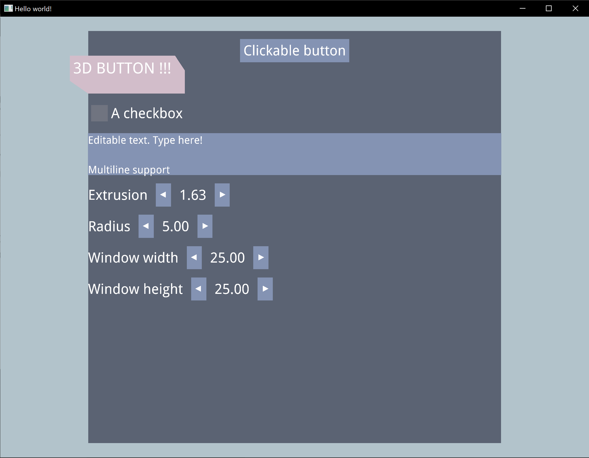
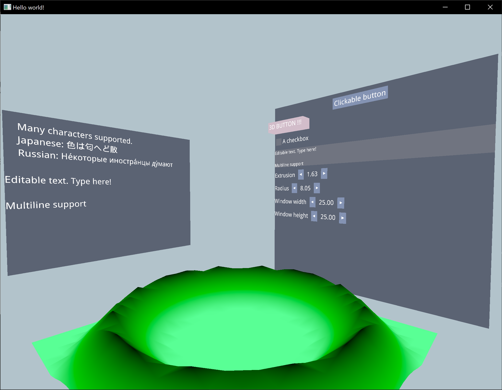

# penGui

An immediate-mode library written in Rust, still in early development.
While the library API is inspired from the [Dear Imgui](https://github.com/ocornut/imgui) C++ library, it aims at providing an easier customisation, more safety, and a fully 3D-capable user-interface.




To install everything needed and run the example :

- Install rust. Instructions can be found [here](https://www.rust-lang.org/tools/install)
- If rust is already installed, make sure that your toolchain version is `>=1.47.0`
- Clone this repository
- To run the example, use the command `cargo run --release --example glium-experimental`
- Eat some cookies while it compiles (it might take two or three minutes to gather all packages necessary and to compile everything)


Inside the example:
- move the mouse while `alt` is pressed to move the camera around, use the arrow keys to move forward, backward, left and right. You can use the mouse wheel to decrease or increase the speed. To move upward and downward, use `left shift` and `left ctrl` while `alt` is pressed. You can use clicks to interact with clickable elements (button, checkbox, ...).
- use `alt+D` to select the display mode: fill, lines or points. The first gives the expected result, the two others are used to debug the geometry.
- press `ctrl+w` to quit the application.

To navigate the documentation, run `cargo doc --no-deps --open`.

## Tests

To run the test suite, run `cargo test`.

If you want to get a coverage report on the test suite, run the following commands :

```sh
cargo install cargo-cov
rustup install nightly
cargo +nightly cov test
cargo +nightly cov report --open
```